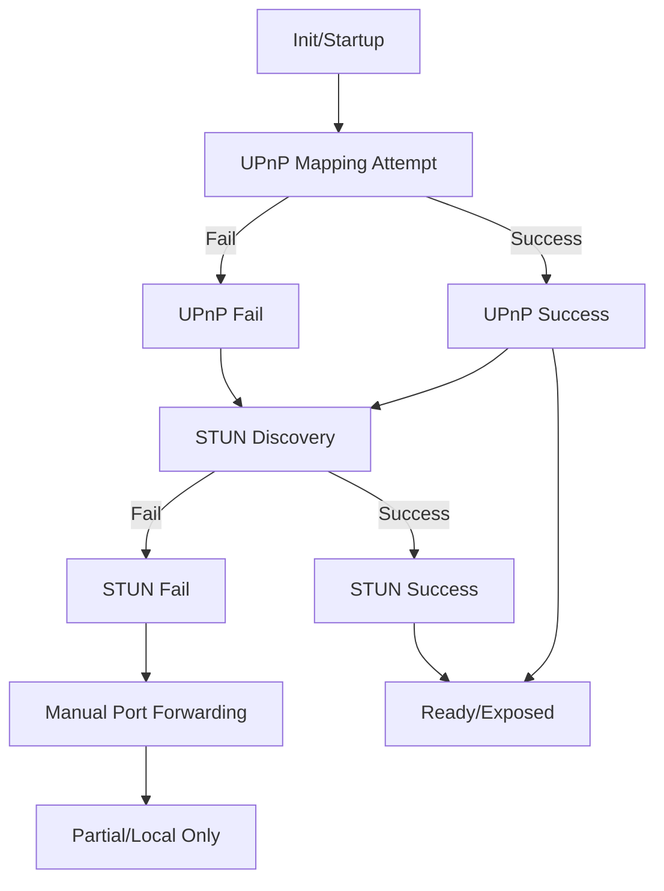

# bNET Auth Server: Direct Exposure State Machine

This document describes the state machine for direct public exposure of the bNET Authentication Server, and the meaning of the GET_NETWORK_STATUS response fields.

## State Machine Overview

The server attempts to expose itself to the public internet using the following prioritized steps:

1. **UPnP Mapping** (if enabled):
   - Attempts to map the listening port on the local router using UPnP.
   - If successful, obtains the external IP and port.
   - Sets `upnp_active = True` and records the external IP.
2. **STUN Discovery** (if enabled):
   - Queries public STUN servers to discover the public IP and port.
   - If successful, records the discovered public endpoint.
   - If UPnP was successful, STUN is used to verify the mapping.
3. **Manual Port Forwarding** (fallback):
   - If neither UPnP nor STUN succeed, the server remains bound to the configured port and host.
   - The admin/user must manually configure port forwarding on their router.

The server periodically refreshes UPnP and STUN discovery to maintain accurate exposure state.

## State Transitions



- **READY**: Server is publicly reachable (UPnP or STUN succeeded).
- **PARTIAL**: Server is only locally reachable; manual intervention required.

## GET_NETWORK_STATUS Response

The server responds to `GET_NETWORK_STATUS` with:

```
NETWORK_STATUS::BOUND::<bound_port>::PUBLIC::<public_ip:public_port>::UPNP::<ON|OFF>
```

- `BOUND`: The local port the server is bound to.
- `PUBLIC`: The public IP and port as detected by UPnP or STUN, or `UNKNOWN` if not available.
- `UPNP`: `ON` if UPnP mapping is active, `OFF` otherwise.

### Example Responses

- `NETWORK_STATUS::BOUND::30301::PUBLIC::203.0.113.42:30301::UPNP::ON`  
  (UPnP succeeded, server is exposed)
- `NETWORK_STATUS::BOUND::30301::PUBLIC::203.0.113.42:30301::UPNP::OFF`  
  (STUN succeeded, UPnP not active)
- `NETWORK_STATUS::BOUND::30301::PUBLIC::UNKNOWN::UPNP::OFF`  
  (No public exposure detected; manual port forwarding required)

## Notes
- The server never attempts reverse tunnels or relays; only direct exposure is supported.
- The state machine is implemented in `server_main.py` via `bootstrap_network_access`, `apply_upnp_mapping`, and `discover_auth_public_endpoint`.
